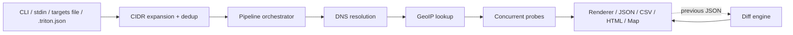

# triton

[](https://github.com/prodrom3/triton/actions/workflows/ci.yml)
[](https://github.com/prodrom3/triton/releases)
[](https://pkg.go.dev/github.com/prodrom3/triton)
[](https://goreportcard.com/report/github.com/prodrom3/triton)
[](https://go.dev/dl/)
[](LICENSE)

A fast, dependency-light network reconnaissance CLI for security, SRE, and network engineering teams. triton consolidates geolocation, DNS, traceroute, port and TLS inspection, HTTP probing, latency measurement, and WHOIS into a single tool with structured output, concurrent target analysis, change detection, and pipeline-friendly exports.

<p align="center">
  
</p>

## Contents

- **Start here**: [Why triton](#why-triton), [Quick Start](#quick-start), [Installation](#installation)
- **Reference**: [Capabilities](#capabilities), [Usage](#usage), [Configuration](#configuration), [Output and Integration](#output-and-integration)
- **Operate**: [Architecture](#architecture), [Operational Notes](#operational-notes), [Responsible Use](#responsible-use), [Security Policy](#security-policy)
- **Project**: [Development](#development), [Support](#support), [License](#license)

## Why triton

- **Single binary, zero runtime deps.** Static Go binary with one optional library dep (`geoip2-golang`). Drops into air-gapped runners, jump boxes, and minimal container images.
- **Pipeline-first.** Structured JSON output, deterministic exit codes, `--quiet`, file-based targets, and stdin piping make it trivial to wire into CI, SOAR playbooks, and cron jobs.
- **Concurrent and bounded.** Multi-target analysis with configurable workers; WHOIS rate limiting, TLS minimum version pinning, and context-based timeouts for predictable behavior under load.
- **Change detection built in.** `--diff` against a previous JSON scan highlights new hosts, changed certificates, moved ASNs, and opened or closed ports.
- **Cross-platform.** Prebuilt releases for Linux, macOS, and Windows on amd64 and arm64.

## Capabilities

**Identity and location**
- IP geolocation (city, region, country, coordinates) via MaxMind GeoLite2
- ASN and organization identification via GeoLite2 ASN
- WHOIS lookup with ARIN referral support, encapsulated rate limiter (10/min)

**Resolution and path**
- DNS A / AAAA resolution with timeout
- DNS record enumeration (MX, TXT, NS, SOA, CNAME) via native Go resolver, concurrent
- System traceroute (no admin required on Windows), reverse DNS enrichment, timeout-hop capture

**Surface inspection**
- TCP connect port scan (IPv4 and IPv6), banner grabbing, 16 concurrent workers
- TLS certificate inspection: issuer, subject, SANs, expiry, self-signed detection, protocol version, TLS 1.2 minimum pinned on all clients
- HTTP probing: status codes, redirect chains, server fingerprint, security header audit (HSTS, CSP, X-Frame-Options, X-Content-Type-Options, Referrer-Policy, Permissions-Policy)
- TCP ping latency (min / avg / max) with packet-loss statistics

**Scale and workflow**
- CIDR expansion with network / broadcast filtering (capped at 65,536 hosts)
- Concurrent target analysis with configurable worker pool
- Target sources: positional args, `--targets FILE`, stdin, config file
- Config file: `.triton.json` in project or home directory
- Change detection via `--diff` against previous JSON scans
- Exports: structured JSON, CSV, self-contained HTML report, Leaflet geo map (all XSS-safe)
- Graceful shutdown: SIGINT / SIGTERM cancel all in-flight probes via context propagation
- Logging: slog multi-handler, timestamped files, automatic rotation (20 files), `--verbose` for probe timings
- Self-update from signed GitHub releases via `--update`

## Quick Start

```bash
# Install
go install github.com/prodrom3/triton@latest

# Download GeoLite2 databases (free MaxMind account required)
#   GeoLite2-City.mmdb, GeoLite2-ASN.mmdb
export GEOIP_DB_PATH=/path/to/GeoLite2-City.mmdb

# Basic recon
triton 8.8.8.8

# Full sweep on a domain, JSON output
triton --dns-all --ports default --tls --whois --http --json example.com

# Scan a subnet, machine-readable
triton --ports default --no-traceroute --json 192.168.1.0/24

# Establish a baseline, then detect drift
triton --output baseline.json example.com
triton example.com --diff baseline.json
```

## Installation

### Binary releases

Prebuilt binaries for Linux, macOS, and Windows (amd64 + arm64) are published on the [Releases](https://github.com/prodrom3/triton/releases) page. Download, verify the checksum, and place on `$PATH`.

### Go install

```bash
go install github.com/prodrom3/triton@latest
```

### From source

```bash
git clone https://github.com/prodrom3/triton.git
cd triton
make build                           # version-stamped build via ldflags
# or:
go build -ldflags "-X main.version=$(cat VERSION)" -o triton .
```

### Self-update

```bash
triton --update
```

Downloads the latest matching release asset from GitHub and replaces the running binary atomically.

### GeoLite2 databases

triton reads [MaxMind GeoLite2](https://dev.maxmind.com/geoip/geolite2-free-geolocation-data) databases (free account required). Both are optional but strongly recommended:

- `GeoLite2-City.mmdb` - geolocation
- `GeoLite2-ASN.mmdb` - ASN and organization

Resolution order:
1. `--db` / `--asn-db` CLI flags
2. `GEOIP_DB_PATH` environment variable
3. Home directory
4. Windows: `%APPDATA%\GeoIP\` and `%PROGRAMDATA%\GeoIP\`

## Usage

```bash
triton [OPTIONS] TARGET [TARGET ...]
cat targets.txt | triton [OPTIONS]
triton --targets hosts.txt [OPTIONS]
```

### Flags

| Flag | Description |
|---|---|
| `TARGET` | IPs, domains, or CIDR ranges (also reads from stdin) |
| `--db PATH` | Path to GeoLite2-City.mmdb (or `GEOIP_DB_PATH` env var) |
| `--asn-db PATH` | Path to GeoLite2-ASN.mmdb |
| `--dns-all` | Query MX, TXT, NS, SOA, CNAME records |
| `--ports [LIST]` | Scan ports (default set, or comma-separated: `--ports 22,80,443`) |
| `--tls` | Inspect TLS certificate on port 443 |
| `--whois` | WHOIS lookup (rate-limited to 10/minute) |
| `--http` | Probe HTTP on open web ports (status, headers, redirects) |
| `--ping` | TCP ping latency measurement (3 probes on port 80) |
| `--all-ips` | Geolocate all resolved IPs, not just the first |
| `--no-traceroute` | Skip traceroute |
| `--max-hops N` | Maximum traceroute hops (default: 20) |
| `--timeout SECS` | Network operation timeout (default: 30) |
| `--workers N` | Concurrent workers (default: 4) |
| `--json` | JSON output |
| `--csv FILE` | Export results to CSV |
| `--html FILE` | Export results to self-contained HTML report |
| `--map FILE` | Export geo map as HTML (Leaflet / OpenStreetMap) |
| `--diff FILE` | Compare results against a previous JSON file |
| `--output FILE` | Save JSON results to file |
| `--targets FILE` | Read targets from file (one per line, `#` comments) |
| `-q, --quiet` | Suppress progress output |
| `--verbose` | Verbose logging to stderr (shows probe timings) |
| `--update` | Update triton to the latest release |
| `-v, --version` | Show version and exit |

### Examples

```bash
# Recon baseline for an asset inventory
triton --dns-all --tls --whois --ports default --http --json \
       --output inventory.json --targets assets.txt

# Quick subnet sweep, no traceroute, CSV for spreadsheets
triton --ports default --no-traceroute --csv hosts.csv 10.0.0.0/24

# Certificate expiry audit
triton --tls --no-traceroute --json --targets domains.txt \
  | jq '.[] | {host: .target, not_after: .tls_cert.not_after}'

# Drift detection in CI
triton --output current.json --targets assets.txt
triton --diff baseline.json --targets assets.txt

# Latency sample for a remote endpoint
triton --ping --no-traceroute api.example.com

# Geo visualization
triton --map map.html --targets vip_hosts.txt

# HTTP security header audit
triton --http --no-traceroute --json example.com | jq '.http_results[].security_headers'
```

## Output and Integration

### Exit codes

| Code | Meaning |
|---|---|
| `0` | All targets analyzed without errors |
| `1` | At least one target produced an error (DNS failure, unreachable, etc.) |
| `2` | Invalid CLI usage or configuration |

### JSON output

`--json` or `--output FILE` produces a stable, typed JSON schema suitable for downstream processing. Every result object includes `target`, `timestamp`, and per-probe sub-objects (`geolocation`, `dns_records`, `traceroute`, `port_results`, `tls_cert`, `whois`, `http_results`, `ping`). Errors per probe are captured in-band rather than aborting the run.

```bash
triton --json 8.8.8.8 | jq '.geolocation.country'
triton --json --targets assets.txt | jq '[.[] | select(.tls_cert.self_signed == true)]'
```

### CSV and HTML

- `--csv FILE` flattens results into a tabular format for BI tools and spreadsheets.
- `--html FILE` produces a self-contained, XSS-escaped HTML report (no external assets).
- `--map FILE` produces a Leaflet geo map (OpenStreetMap tiles, `textContent`-safe rendering).

### CI example (GitHub Actions)

```yaml
- name: Recon drift check
  run: |
    triton --targets assets.txt --json --output current.json
    triton --targets assets.txt --diff baseline.json --output diff.json
- uses: actions/upload-artifact@v4
  with:
    name: recon-report
    path: |
      current.json
      diff.json
```

## Configuration

Create `.triton.json` in the working directory or your home directory to set defaults. The working directory takes precedence. CLI flags override config values.

```json
{
  "db": "/path/to/GeoLite2-City.mmdb",
  "asn_db": "/path/to/GeoLite2-ASN.mmdb",
  "timeout": 15,
  "workers": 8,
  "dns_all": true,
  "tls": true,
  "whois": true,
  "http": true,
  "ping": true,
  "ports": "22,80,443,8080"
}
```

## Architecture



Concurrent probes fan out per target: traceroute, WHOIS, DNS records, port scan, TLS, HTTP, ping. Each probe runs in its own goroutine under a shared `context.Context`, so `Ctrl+C` or `--timeout` cancels every pending network call cleanly.

### Package layout

```
main.go                      CLI, signal handling, orchestration
internal/models              typed results + JSON serialization
internal/config              .triton.json loader
internal/geo                 GeoLite2 reader + bounded cache
internal/network             DNS, reverse DNS, WHOIS, rate limiter
internal/dns                 DNS record enumeration
internal/scanner             TCP scan, banner grab, TLS inspection
internal/httpprobe           HTTP probe + security header audit
internal/ping                TCP ping latency
internal/tracer              Cross-platform traceroute
internal/pipeline            Per-target concurrent orchestration
internal/output              Renderer (ANSI, cached detection)
internal/export              CSV, HTML, Leaflet map (XSS-safe)
internal/diff                JSON comparison, change detection
internal/logging             slog multi-handler + rotation
internal/updater             Self-update from GitHub releases
```

## Operational Notes

- **Defaults are conservative.** 4 workers, 30s timeout, traceroute on by default. Tune via `--workers` and `--timeout` for your environment.
- **WHOIS is rate-limited** to 10 queries/minute to stay within RIR fair-use policies. The limiter is per-process; across parallel invocations, coordinate externally.
- **GeoIP reads are lock-free** (mmap-backed). The result cache uses a per-map RWMutex and bounded FIFO eviction.
- **IPv6 is first-class** across DNS, scanner, tracer, and HTTP probes (`net.JoinHostPort` throughout).
- **TLS clients pin minimum version 1.2.** Certificate inspection falls back to an InsecureSkipVerify dial only to read self-signed chains; results flag `self_signed: true`.
- **HTML and map exports are XSS-safe** via `html.EscapeString` and `textContent`-only DOM injection.
- **CIDR is capped at /16** (65,536 hosts) to prevent accidental Internet-scale scans.

## Responsible Use

triton is intended for authorized network reconnaissance: asset inventory, attack surface management, blue-team drift detection, incident response, and lab/CTF use.

**You are responsible for obtaining authorization before scanning any network or host you do not own.** Port scanning, banner grabbing, and aggressive traceroute may be considered intrusive or illegal in some jurisdictions. The authors accept no liability for misuse.

## Security Policy

Report security vulnerabilities privately by opening a [GitHub Security Advisory](https://github.com/prodrom3/triton/security/advisories/new). Please do not disclose publicly until a fix is available.

## Development

```bash
make build     # version-stamped binary
make test      # go test ./... -v
make cover     # coverage report (HTML)
make lint      # go vet + staticcheck

go run . 8.8.8.8
```

### CI

GitHub Actions runs on every push and PR:
- **test matrix**: `{ubuntu, macos, windows} x {go 1.23, go 1.24}`
- **lint**: `go vet` + `staticcheck`
- **release**: goreleaser builds linux/darwin/windows x amd64/arm64 on tag

### Dependencies

- [geoip2-golang](https://github.com/oschwald/geoip2-golang) - MaxMind GeoLite2 reader
- Go standard library for all other functionality (networking, TLS, DNS, CLI, JSON, CSV, HTTP)

## Support

- **Issues and feature requests**: [GitHub Issues](https://github.com/prodrom3/triton/issues)
- **Security vulnerabilities**: see [Security Policy](#security-policy)
- **Contributions**: fork, branch, PR. Please include tests and run `make lint` before submitting.

## License

MIT. See [LICENSE](LICENSE).

Created by [prodrom3](https://github.com/prodrom3) at [radamic](https://github.com/radamic).

<details>
<summary>Why "triton"?</summary>

In Greek mythology, Triton is the messenger of the sea, a god who could calm or raise the waters and who knew every current and depth of the ocean. Just as Triton surveyed and commanded the vast network of seas, this tool surveys and maps the vast network of the internet, tracing routes across its depths, uncovering what lies beneath domain names, and revealing the geography and identity behind IP addresses. The name also nods to the trident, a tool of precision and reach, reflecting triton's ability to probe ports, inspect certificates, and query registries in a single sweep.

</details>
